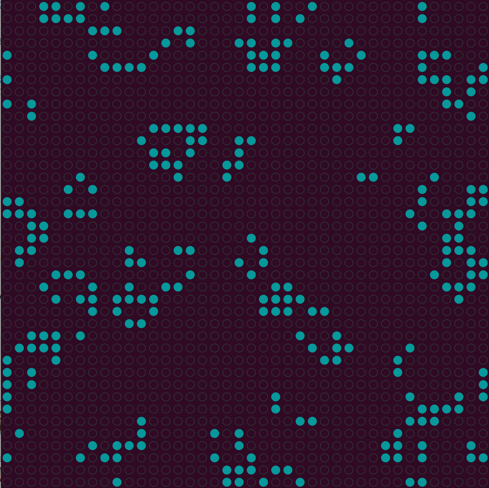

# Game of Life
Conway's Game of Life 
Implemented in Rust with random starting positions. 
TODO: add optional Universe initializations with more complex structures like Gosper's glider gun or puffer-type breeder. 

